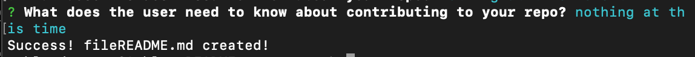

# README-generator
 
  ## Description
  
  This project is an application that dynamically generates a README from a user's input.

  ## User Story

  ```
  AS a developer

  I WANT a README generator

  SO THAT I can easily put together a good REAMDE for a new project

  ```

  ## Table Of Contents
  
  * [Installation](#installation)
  
  * [Usage](#usage)
  
  * [Demo of Application](#demo-of-application)
  
  * [Questions](#questions)
  
  ## Installation
  
  To install necessary dependencies, run the following command:
  
  ```
  npm i
  ```
  Once dependencies are installed, the application is ready to run. 

  ## Usage

  To run the application from the command line please run the following command:

  ```
  node index.js
  ``` 
  
  Following the command, the user will be instructed to answer questions regarding their project. Following the last question, the data input is written in the generate README file and the user is notifed.


  
  

  The user can now view the generated README file by running the following command:

  ```
  code .
  ``` 


  
  ## Demo of Application
  

  *demo of command to run application and generated questions*

  
  
  *demo of generated README from command line*


  ## Questions
  
  If you have any questions about this project, please contact ashleydeyoung at ashley.d.deyoung@gmail.com.